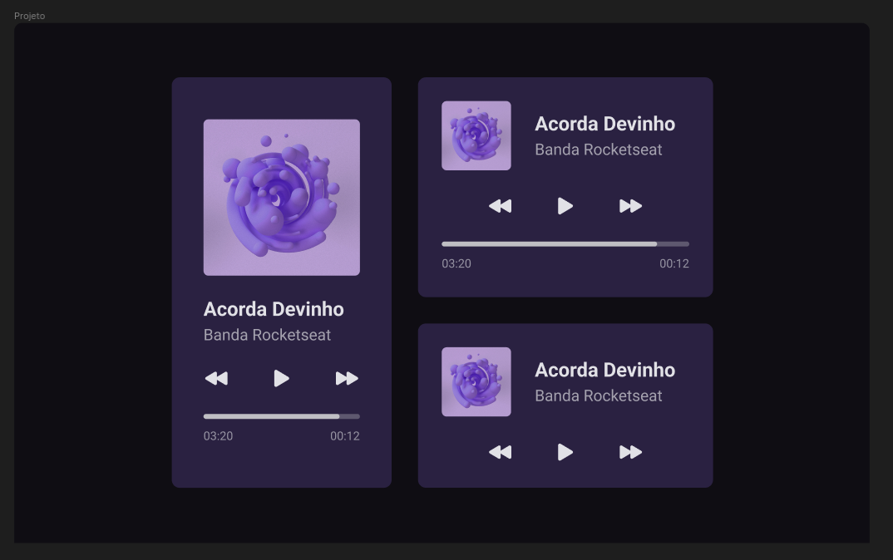

# Bora Codar

Um projeto por semana para você se desenvolver e aprimorar suas habilidades técnicas!

Proposto por: [RocketSeat](https://www.rocketseat.com.br/boracodar)

## Semana 1 - Player de Música

Layout no figma:

## Design

### Cores

- **Cor primária:** #2A2141
- **Cor secundária:** #0F0D13
- **Tons de cinza**
  - #E1E1E6
  - #D9D9D9
  - #C4C4CC

### Tipografia:

- **Fonte:** Roboto
- **Tamanhos de fonte**
  - Heading
    - sm: 24
    - xs: 18
  - Texto: 14
- **Altura de Linha**
  - Heading: 100%
  - Texto: 160%

## Técnologias utilizadas:

    
    
    

